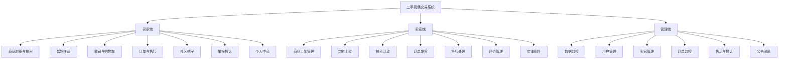
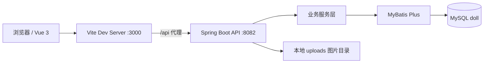
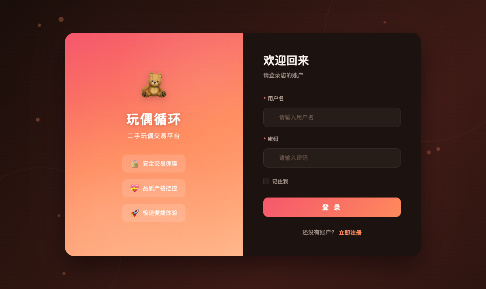
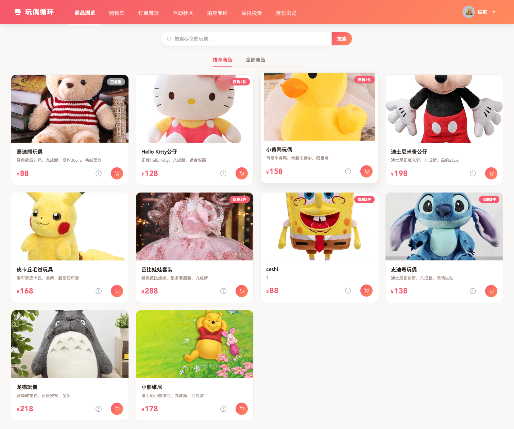
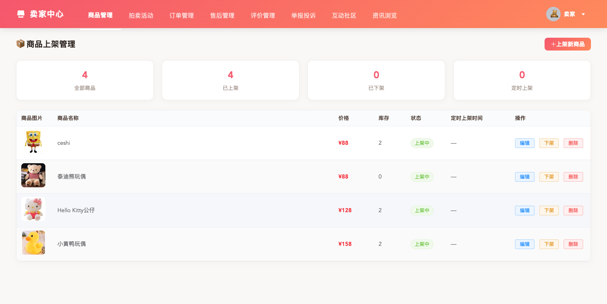
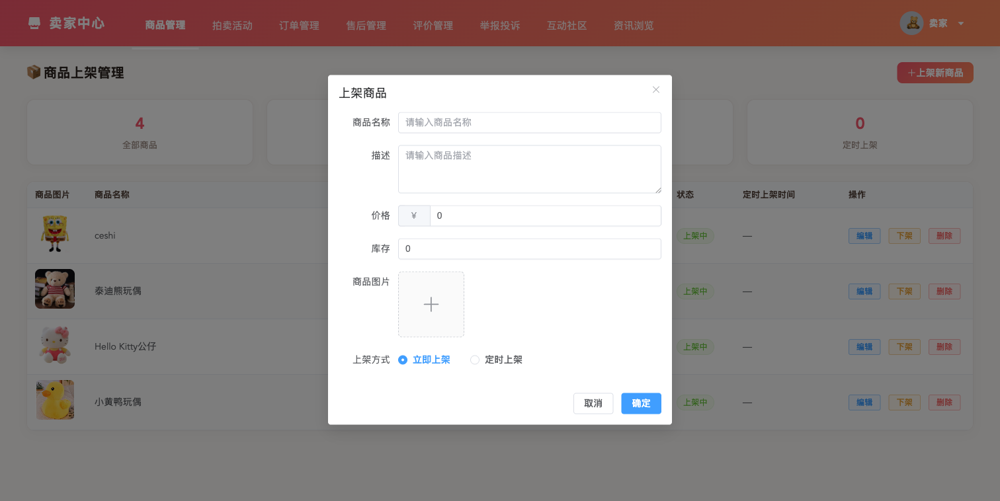
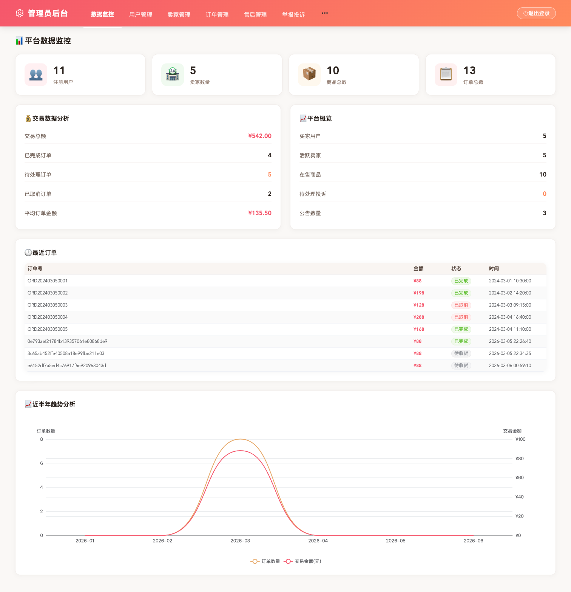

# 二手玩偶交易系统

一个基于 Spring Boot、MyBatis Plus、Vue 3 和 Element Plus 的二手玩偶交易平台。项目覆盖买家、卖家、管理员三类角色，包含商品交易、购物车、订单售后、拍卖、互动社区、评价、投诉与公告内容管理等模块，适合作为 Java Web 课程设计或全栈 CRUD 实训项目。

## 演示视频

完整网站演示视频随仓库发布在 [`docs/video/doll-demo.mp4`](docs/video/doll-demo.mp4)，时长约 52.5 秒。视频使用真实页面截图制作，按买家、卖家、管理员三类角色依次走查主要业务流程。

### 演示流程

| 步骤 | 页面 | 说明 |
| --- | --- | --- |
| 01 | 登录入口 | 从统一登录页进入系统 |
| 02 | 买家商品浏览 | 查看推荐商品、搜索、收藏、举报和加入购物车 |
| 03 | 商品详情 | 查看图片、价格、库存、描述、购买入口和评价 |
| 04 | 购物车 | 调整数量、勾选商品并进入结算 |
| 05 | 买家订单 | 跟踪支付、发货、收货、评价和售后状态 |
| 06 | 互动社区 | 浏览帖子和发布玩偶收藏分享 |
| 07 | 买家拍卖 | 查看起拍价、当前价、倒计时和出价入口 |
| 08 | 卖家商品管理 | 维护商品、库存、上下架和编辑删除操作 |
| 09 | 上架商品弹窗 | 填写商品信息、上传图片并设置定时上架 |
| 10 | 卖家订单 | 查看买家订单并处理发货 |
| 11 | 卖家拍卖活动 | 创建拍卖并查看当前价、中标者和状态 |
| 12 | 管理员数据看板 | 汇总用户、卖家、商品、订单、交易额和趋势 |
| 13 | 用户与卖家管理 | 查看角色、手机号、注册时间和账号状态 |
| 14 | 举报投诉处理 | 跟踪投诉目标、原因、状态和处理结果 |
| 15 | 公告内容维护 | 管理公告资讯和首页运营内容 |

## 功能模块



## 系统架构



## 界面预览

| 登录页 | 买家商品浏览 |
| --- | --- |
|  |  |

| 卖家商品管理 | 上架商品弹窗 |
| --- | --- |
|  |  |

| 管理员数据监控 |
| --- |
|  |

## 技术栈

- 后端：Spring Boot 2.7.14、MyBatis Plus 3.5.3.1、MySQL 8、JWT、Lombok
- 前端：Vue 3、Vue Router、Pinia、Element Plus、Axios、Vite
- 演示视频：Remotion
- 推荐运行环境：JDK 17、Node.js 18+、MySQL 8+

## 快速开始

### 1. 初始化数据库

默认数据库名为 `doll`。如果你的 MySQL 账号密码不是 `root/root`，请按实际情况调整命令或设置环境变量。

```bash
mysql -uroot -proot -e "CREATE DATABASE IF NOT EXISTS doll DEFAULT CHARACTER SET utf8mb4 COLLATE utf8mb4_unicode_ci;"
mysql -uroot -proot doll < doll.sql
```

### 2. 启动后端

```bash
cd backend
export JAVA_HOME=$(/usr/libexec/java_home -v 17) # macOS，可按本机环境替换
export SPRING_DATASOURCE_PASSWORD=root
mvn spring-boot:run
```

后端默认运行在 `http://localhost:8082`。

### 3. 启动前端

```bash
cd frontend
npm install
npm run dev
```

前端默认运行在 `http://localhost:3000`，开发代理会把 `/api` 转发到后端 `8082`。

## 环境变量

参考 `.env.example`：

| 变量 | 默认值 | 说明 |
| --- | --- | --- |
| `SPRING_DATASOURCE_URL` | `jdbc:mysql://localhost:3306/doll?...` | MySQL 连接串 |
| `SPRING_DATASOURCE_USERNAME` | `root` | MySQL 用户名 |
| `SPRING_DATASOURCE_PASSWORD` | `root` | MySQL 密码 |
| `SERVER_PORT` | `8082` | 后端端口 |
| `JWT_SECRET` | demo secret | JWT 签名密钥，生产环境必须替换 |
| `JWT_EXPIRATION` | `604800` | Token 有效期，单位秒 |
| `VITE_API_BASE_URL` | `/api` | 前端 API 基础路径 |

## 演示账号

| 角色 | 用户名 | 密码 |
| --- | --- | --- |
| 买家 | `buyer1` | `123456` |
| 卖家 | `seller1` | `123456` |
| 管理员 | `admin` | `admin123` |

## 测试与验证

启动前后端后执行：

```bash
scripts/smoke_api.sh
```

已验证项目：

- `mvn test`
- `npm run build`
- `scripts/smoke_api.sh`
- 浏览器烟测：登录页、买家商品浏览、卖家商品管理、上架商品弹窗、管理员数据监控

## 常用 API

- `POST /api/user/login`：登录
- `POST /api/user/register`：注册
- `GET /api/product/search?keyword=娃`：商品搜索
- `GET /api/product/recommend?userId=4`：推荐商品
- `GET /api/cart/user/{userId}`：购物车
- `GET /api/order/buyer/{buyerId}`：买家订单
- `GET /api/order/seller/{sellerId}`：卖家订单
- `GET /api/auction/list`：拍卖列表
- `GET /api/complaint/list`：投诉列表
- `GET /api/news/list`：公告资讯

## 项目结构

```text
.
├── backend/                 # Spring Boot 后端
├── frontend/                # Vue 3 前端
├── docs/
│   ├── screenshots/         # 演示截图
│   └── video/               # 演示视频
├── scripts/
│   └── smoke_api.sh         # API 烟测脚本
├── doll.sql                 # 干净演示数据库
├── schema.sql               # 基础建表脚本
└── .env.example             # 环境变量示例
```

## 开源安全说明

本仓库只包含演示配置与合成演示数据。真实部署前请替换 `JWT_SECRET`、数据库密码和演示账号密码，并阅读 `SECURITY.md`。
